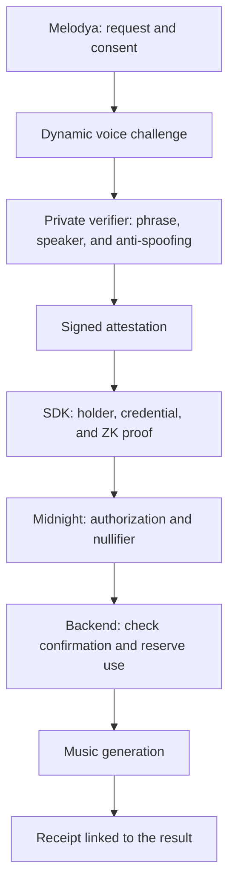

# VoiceProof · Proof of Voice Authorization

**An SDK that links voice verification to consent for a specific use and a verifiable authorization on Midnight.**

The first use case is allowing someone to authorize a song generated with their voice in **Melodya**, without publishing audio, embeddings, or biometric scores on the ledger.

> **Status: executable development scaffold.** The repository includes an SDK workspace, protocol types, API and verifier boundaries, a Compact toolchain fixture, local infrastructure, and CI. Voice verification, voice authorization contracts, and music generation are not implemented. Authorization API examples below remain illustrative.

## What we want to prove

The protocol's claim will be:

> The party controlling the secret associated with a valid credential authorized a specific use, and an approved verifier attested that a sample passed the voice verification policy for that same challenge.

The proof combines two different kinds of evidence:

1. **Biometric attestation:** an external service checks the speaker, a dynamic phrase, and spoofing/liveness signals, then signs the result and its context.
2. **ZK authorization:** the contract checks the signature, credential, knowledge of the holder's secret, consent, validity, and replay protection.

Midnight will verify the protocol's cryptographic conditions. **It will not run the voice model or independently prove that its biometric decision is correct.** Trust in the verifier, its models, and its policy remains explicit.

The repository is named `midnight-proof-of-voice`; the product is defined as **Proof of Voice Authorization**. We do not claim legal ownership of a voice, civil identity, or infallible deepfake detection.

## The intended experience

1. A person enrolls three voice samples and receives a credential bound to a secret they control.
2. Melodya presents the specific request: what will be generated, for which purpose, under which permissions, and for which application.
3. The person consents and responds to an unpredictable, short-lived voice challenge.
4. The verifier checks the phrase, speaker, and attack signals; if accepted, it signs an attestation.
5. The SDK prepares a proof binding that attestation to the holder, credential, and consent.
6. Midnight accepts the authorization and records its consumption to prevent reuse.
7. The backend checks the confirmed authorization and reserves a single generation job.
8. The song is associated with a verifiable receipt without publishing its biometric inputs.



A biometric rejection, revoked credential, expired authorization, or repeated use must prevent access to generation.

## First MVP scope

| Area | v0.1 objective |
| --- | --- |
| Enrollment | Three samples, quality checks, and an encrypted template |
| Verification | Speaker verification, a dynamic phrase, and anti-spoofing evaluation |
| Credential | A dedicated format bound to the holder and a template commitment |
| Consent | One request, with an explicit purpose, audience, and permissions |
| Midnight | Check attestation, holder, validity, revocation, and nullifier |
| Integration | A backend that requires confirmed authorization before generation |
| Receipt | A verifiable reference to the authorized use and a private link to the result |
| UX | DUST sponsorship, separating the payer from the authorizing party |

We will evaluate ECAPA-TDNN and TitaNet; model selection and thresholds will depend on our own measurements. A dynamic phrase reduces certain playback attacks but does not replace evaluation against real-time synthesis.

The first MVP excludes civil identity, proof of legal ownership, mandatory DID/VC compatibility, voice model training, native iOS/Android SDKs, and Mainnet deployment. It will not offer blanket authorization for all future songs.

## The API we want to offer

**Proposed developer experience, not currently available code:**

```ts
const authorization = await voiceproof.authorize({
  credentialId,
  requestId,
  purpose: "music-generation",
  audience: "melodya",
  resourceCommitment: generationRequestCommitment,
  permissions: { commercialUse: false, training: false },
});

// The backend independently verifies this reference.
// It never trusts a client-supplied verified boolean.
await melodya.requestGeneration({
  requestId,
  authorizationRef: authorization.reference,
});
```

The SDK will coordinate the challenge, capture through the application, consent, and proof. The wallet, biometric transport, and proving provider will have explicit responsibilities. Secrets will not be shared with the sponsor.

The song does not exist before generation: `generationRequestCommitment` will bind an **immutable generation request**, not an assumed hash of future audio. The result will be linked to the receipt after generation.

## Privacy boundary

| Information | Intended handling |
| --- | --- |
| Enrollment/challenge audio | Private processing with a defined minimum retention period |
| Embedding/template, score, and anti-spoofing signals | Private; never on the ledger or in public logs |
| Account identity and internal template ID | The application's private database |
| Holder secret | The device or a proving environment explicitly trusted by the user |
| Commitments, revocation, and nullifiers | Minimal public protocol state |
| Detailed consent and request | Private; the ledger receives their commitments |
| Receipt | A public authorization reference and private result metadata |

**Private from the ledger does not mean invisible to everyone.** In the MVP, the biometric service will see the samples it processes. A remote prover may receive witnesses. The architecture limits and documents these boundaries; it does not promise entirely on-device processing.

Commitments do not imply anonymity either: the initial revocation design may link uses of the same credential. The [architecture](docs/architecture.md) documents this limitation.

## Inspiration: a small, verifiable SDK

Our reference is [midnight-prover-ios](https://github.com/sleepydogo/midnight-prover-ios), which separates its proving core from cryptographic material providers and exposes a focused native API.

We will apply that discipline to VoiceProof: separate protocol and integration, verify artifacts, distinguish proofs from on-chain confirmation, document limits, and test the package from a consuming application. **This is neither a fork nor an announced iOS integration**; its benchmarks and versions are not guarantees for our circuits.

The architecture also draws on [Midnight-Skills](https://github.com/Kali-Decoder/Midnight-Skills), checking its examples against the APIs and the [official compatibility matrix](https://docs.midnight.network/relnotes/support-matrix).

## First success milestone

On **Preview**, a test credential and a signed attestation must establish:

```text
knowledge of the holder's secret
+ a valid, non-revoked credential
+ an attestation from an approved verifier
+ a valid challenge bound to the request
+ consent for that use
+ an unused nullifier
→ confirmed authorization
```

Initial fixtures validate cryptography, not biometric quality. The integrated milestone is complete when:

- The test holder completes the flow and receives a song with its receipt.
- An impostor or rejected sample cannot produce a valid authorization.
- Authorization for request A cannot enable request B, another audience, or another purpose.
- Two concurrent requests using the same authorization create at most one generation job.
- Revoking a credential prevents new authorizations under the documented policy.

## Implementation path

1. **Protocol and feasibility:** define encoding, signatures verifiable in Compact, commitments, time, revocation, and replay protection; measure the smallest circuit.
2. **Private biometrics:** implement enrollment, challenges, and calibrated verifier evaluation with defined retention and model versions.
3. **SDK and Preview:** integrate both paths, sponsorship, confirmation, and single consumption in the backend.
4. **Pilot and hardening:** evaluate attacks, false acceptances/rejections, latency, recovery, and operations; pass through Preprod before considering Mainnet.

Progress depends on acceptance criteria. A successful demo does not establish a production date or a security guarantee.

## Documentation and license

English is the project language for documentation, diagrams, code comments, messages, and contributions.

- [Initial architecture](docs/architecture.md): components, flow, contract, data, risks, and open decisions.
- [Apache-2.0 license](LICENSE): the repository's original license is preserved.

## Start developing

Requirements: Linux x86_64, Node.js 22.22.1, Python 3.11, and Docker with Compose
for integration services. No wallet or biometric data is needed for unit checks.

```bash
npm ci --ignore-scripts
npm run setup:compact
npm run setup:python
npm run setup:env
npm run check
npm run example:melodya
```

Start dependencies with `npm run env:up` (Midnight) and `npm run data:up`
(PostgreSQL). In separate terminals, run `npm run dev:api` and
`npm run dev:verifier`. Services expose `/health/live` (200) and `/health/ready`
(503 until implemented). Sensitive operations deliberately return 501.

```text
packages/sdk/                 Midnight provider integration
packages/protocol/            Draft application types
services/api/                 Node API boundary, port 3000
services/voice-verifier/      FastAPI verifier boundary, port 8000
contracts/                    Counter fixture and voice contract requirements
infra/                        Local PostgreSQL configuration
examples/melodya/              Built SDK configuration example
bench/                        Evaluation criteria
vendor/midnight-skills/        Pinned skills and original notices
```

See [development setup](docs/development.md), [protocol decisions](docs/protocol.md),
[threat model](docs/threat-model.md), [privacy model](docs/privacy-model.md), and
[implementation milestones](docs/roadmap.md). Work stays on `main`; packages are
private and are not published to npm.
