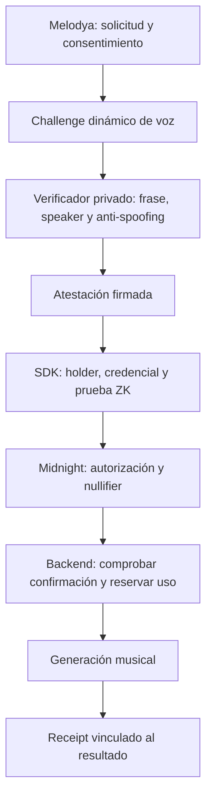

# VoiceProof · Proof of Voice Authorization

**Un SDK para vincular la verificación de una voz con el consentimiento para un uso concreto y una autorización verificable en Midnight.**

Primer caso de uso: permitir que una persona autorice la generación de una canción con su voz en **Melodya**, sin publicar audio, embeddings ni scores biométricos en el ledger.

> **Estado: diseño inicial.** Este repositorio contiene el README y la arquitectura propuesta. Todavía no ofrece un SDK instalable, verificación biométrica implementada, contratos desplegados ni garantías de producción. Los ejemplos de API son ilustrativos.

## Qué queremos demostrar

El claim del protocolo será:

> Quien controla el secreto asociado a una credencial vigente autorizó un uso específico, y un verificador admitido atestiguó que una muestra superó la política de verificación de voz para ese mismo challenge.

La prueba combina dos evidencias diferentes:

1. **Atestación biométrica:** un servicio externo verifica speaker, frase dinámica y señales de spoofing/liveness; firma el resultado y su contexto.
2. **Autorización ZK:** el contrato verifica la firma, la credencial, el conocimiento del secreto del holder, el consentimiento, la vigencia y la protección contra replay.

Midnight verificará las condiciones criptográficas del protocolo. **No ejecutará el modelo de voz ni demostrará por sí mismo que su decisión biométrica es correcta.** La confianza en el verificador, sus modelos y su política sigue siendo explícita.

El repositorio se llama `midnight-proof-of-voice`; el producto se define como **Proof of Voice Authorization**. No afirmamos propiedad jurídica de una voz, identidad civil ni detección infalible de deepfakes.

## La experiencia que buscamos

1. La persona registra tres muestras de voz y recibe una credencial vinculada a un secreto bajo su control.
2. Melodya presenta la solicitud concreta: qué se generará, para qué, con qué permisos y para qué aplicación.
3. La persona acepta y responde un challenge de voz impredecible y de corta duración.
4. El verificador comprueba la frase, el speaker y las señales de ataque; si acepta, firma una atestación.
5. El SDK prepara una prueba que vincula esa atestación con el holder, la credencial y el consentimiento.
6. Midnight acepta la autorización y registra su consumo para impedir su reutilización.
7. El backend comprueba la autorización confirmada y reserva una única tarea de generación.
8. La canción queda asociada a un receipt verificable, sin publicar su biometría.



Un rechazo biométrico, una credencial revocada, una autorización vencida o un uso repetido deben impedir el acceso a la generación.

## Alcance del primer MVP

| Área | Objetivo v0.1 |
| --- | --- |
| Enrollment | Tres muestras, controles de calidad y template cifrado |
| Verificación | Speaker verification, frase dinámica y evaluación anti-spoofing |
| Credencial | Formato propio, vinculado al holder y a un commitment del template |
| Consentimiento | Una solicitud; propósito, audiencia y permisos explícitos |
| Midnight | Verificar atestación, holder, vigencia, revocación y nullifier |
| Integración | Backend que exige autorización confirmada antes de generar |
| Receipt | Referencia verificable al uso autorizado y vínculo privado al resultado |
| UX | Sponsorship de DUST, separando al pagador de quien autoriza |

Se evaluarán ECAPA-TDNN y TitaNet; el modelo y sus umbrales se decidirán con mediciones propias. Una frase dinámica reduce ciertos ataques de reproducción, pero no sustituye la evaluación frente a síntesis en tiempo real.

Quedan fuera del primer MVP: identidad civil, prueba de titularidad legal, compatibilidad DID/VC obligatoria, entrenamiento de modelos de voz, SDK nativo iOS/Android y despliegue Mainnet. Tampoco habrá autorización abierta para todas las canciones futuras.

## API que queremos ofrecer

**Propuesta de ergonomía, no código disponible actualmente:**

```ts
const authorization = await voiceproof.authorize({
  credentialId,
  requestId,
  purpose: "music-generation",
  audience: "melodya",
  resourceCommitment: generationRequestCommitment,
  permissions: { commercialUse: false, training: false },
});

// El backend verifica esta referencia por su cuenta.
// Nunca confía en un booleano verified enviado por el cliente.
await melodya.requestGeneration({
  requestId,
  authorizationRef: authorization.reference,
});
```

El SDK coordinará el challenge, la captura mediante la aplicación, el consentimiento y la prueba. La wallet, el transporte biométrico y el proveedor de proving tendrán responsabilidades explícitas. Los secretos no se entregarán al sponsor.

Antes de generar no existe la canción: `generationRequestCommitment` vinculará una **solicitud inmutable de generación**, no un supuesto hash del audio futuro. El resultado se enlazará al receipt después de producirse.

## Frontera de privacidad

| Información | Tratamiento previsto |
| --- | --- |
| Audio de enrollment/challenge | Procesamiento privado y retención mínima definida |
| Embedding/template, score y señales anti-spoofing | Privados; nunca ledger ni logs públicos |
| Identidad de cuenta y template ID interno | Base privada de la aplicación |
| Secreto del holder | Dispositivo o entorno de proving expresamente confiado por el usuario |
| Commitments, revocación y nullifiers | Estado público mínimo del protocolo |
| Consentimiento y solicitud detallados | Privados; el ledger recibe sus commitments |
| Receipt | Referencia pública de autorización y metadatos privados del resultado |

**Privado frente al ledger no significa invisible para todos.** En el MVP, el servicio biométrico verá las muestras que procesa. Un prover remoto puede recibir witnesses. La arquitectura limita y documenta esas fronteras; no promete procesamiento íntegramente en el dispositivo.

Los commitments tampoco implican anonimato: el esquema inicial de revocación puede vincular usos de una misma credencial. Esta limitación se detalla en la [arquitectura](docs/architecture.md).

## Inspiración: un SDK pequeño y verificable

Tomamos como referencia [midnight-prover-ios](https://github.com/sleepydogo/midnight-prover-ios), que separa su núcleo de proving de los proveedores de material criptográfico y expone una API nativa acotada.

Aplicaremos esa disciplina a VoiceProof: separar protocolo e integración, verificar artefactos, distinguir prueba de confirmación on-chain, documentar límites y probar el paquete desde una aplicación consumidora. **No es un fork ni una integración iOS anunciada**; sus benchmarks y versiones no son garantías para nuestros circuitos.

La arquitectura también se apoya en [Midnight-Skills](https://github.com/Kali-Decoder/Midnight-Skills), contrastando sus ejemplos con las APIs y la [matriz oficial de compatibilidad](https://docs.midnight.network/relnotes/support-matrix).

## Primer hito de éxito

En **Preview**, una credencial de prueba y una atestación firmada permiten demostrar:

```text
conocimiento del secreto del holder
+ credencial vigente y no revocada
+ atestación de un verificador admitido
+ challenge vigente y vinculado a la solicitud
+ consentimiento para ese uso
+ nullifier no utilizado
→ autorización confirmada
```

Los fixtures iniciales validarán la criptografía, no la calidad biométrica. El hito integrado se considerará cumplido cuando:

- El titular de prueba complete el flujo y obtenga una canción con su receipt.
- Un impostor o una muestra rechazada no produzcan una autorización válida.
- Una autorización para la solicitud A no habilite B, otra audiencia ni otro propósito.
- Dos peticiones concurrentes con la misma autorización creen como máximo una tarea de generación.
- Revocar una credencial impida nuevas autorizaciones según la política documentada.

## Camino de implementación

1. **Protocolo y viabilidad:** fijar encoding, firmas verificables en Compact, commitments, reloj, revocación y replay; medir el circuito mínimo.
2. **Biometría privada:** enrollment, challenge y evaluación calibrada del verificador, con retención y versiones de modelo definidas.
3. **SDK y Preview:** integrar las dos rutas, sponsorship, confirmación y consumo único en el backend.
4. **Piloto y endurecimiento:** evaluar ataques, falsos aceptados/rechazados, latencias, recuperación y operación; pasar por Preprod antes de considerar Mainnet.

El avance depende de criterios de aceptación. No hay una fecha de producción ni una garantía de seguridad derivada de una demo exitosa.

## Documentación y licencia

- [Arquitectura inicial](docs/architecture.md): componentes, flujo, contrato, datos, riesgos y decisiones pendientes.
- [Licencia Apache-2.0](LICENSE): se conserva la licencia inicial del repositorio.

No hay instrucciones de instalación aún: este primer cambio publica exclusivamente el diseño del producto.
