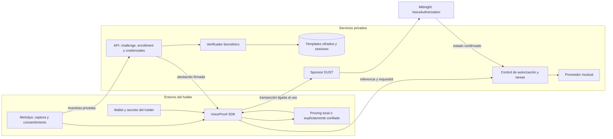

# Arquitectura inicial · Proof of Voice Authorization

**Estado:** propuesta v0.1, sin implementación del protocolo ni despliegue.

**Consumidor inicial:** Melodya. **Superficie inicial:** SDK TypeScript y servicios de referencia.

**Entornos:** simulación/local → Preview → Preprod → Mainnet, con criterios de salida por etapa.

## 1. Claim y límites de confianza

El sistema pretende demostrar que quien conoce el secreto de una credencial vigente autorizó una solicitud y presentó una atestación válida de verificación de voz para ese contexto.

Enrollment demuestra continuidad respecto de un template registrado; no certifica identidad civil, origen legítimo de las muestras ni propiedad jurídica de una voz.

| Actor | Responsabilidad y confianza necesaria |
| --- | --- |
| Holder | Controlar su secreto y aprobar el consentimiento que firma/prueba |
| Aplicación | Mostrar la solicitud real y capturar audio sin sustituir el contexto aprobado |
| Emisor | Emitir/revocar credenciales y vincular correctamente template y holder |
| Verificador | Evaluar audio con una política versionada y firmar sólo decisiones aceptadas |
| Prover | Ejecutar el circuito; conoce los witnesses que recibe, aunque no se publiquen |
| Sponsor | Pagar DUST y transmitir; no adquiere autoridad sobre el holder |
| Contrato | Aplicar las restricciones criptográficas y actualizar el estado |
| Backend musical | Verificar contexto/confirmación y hacer cumplir consumo único y permisos |

El circuito verificará una firma sobre una decisión biométrica. No ejecutará ML. Un emisor o verificador comprometido puede emitir evidencia falsa dentro de sus atribuciones; ZK no corrige esa fuente de confianza. Se requieren control de claves, rotación, pausa y revocación.

## 2. Componentes propuestos



El primer cliente de referencia puede ser una CLI Node.js controlada por el holder. La experiencia web se incorporará sin convertir al backend en custodio implícito de su secreto. El SDK no implementará ML, un motor criptográfico propio ni una wallet nueva.

El proving remoto introduce confianza adicional: no enviar secretos a un endpoint sólo por ser HTTPS ni prometer que el witness permanece local cuando no sea cierto. El sponsor recibirá una transacción ligada a la acción, no entradas privadas para rehacerla.

## 3. Inspiración de midnight-prover-ios

Referencia revisada: [commit 05954e1](https://github.com/sleepydogo/midnight-prover-ios/tree/05954e163087c0c6c25734dbd77c926ddc69f55e).

| Patrón observado | Decisión para VoiceProof |
| --- | --- |
| Núcleo separado del acceso a archivos/red mediante proveedores | Separar protocolo de wallet, almacenamiento y transporte |
| API pública reducida para proving y verificación | Operaciones de autorización con estados y errores explícitos |
| Descargas contrastadas con digests | Artefactos con versión y manifiesto autenticado; rechazar discrepancias |
| Límites reales de memoria, progreso y cancelación | Medir nuestros circuitos; cancelar antes de submit no cancela una transacción enviada |
| Fixtures de referencia y consumidor externo | Separar tests de protocolo, integración y consumo del paquete publicado |

No se copia su implementación Rust/Swift ni se presupone compatibilidad binaria. Un adaptador iOS será una evaluación posterior, sujeta a versiones, coste del circuito y verificación cruzada. El MVP reutilizará el stack oficial de Midnight.

## 4. Objetos del protocolo

Estos campos son un modelo lógico; aún no constituyen una serialización interoperable.

| Objeto | Contenido vinculado |
| --- | --- |
| `VoiceCredential` | Versión, emisor/key ID, holder commitment, template commitment, política/modelo, emisión, expiración y referencia de estado; firma del emisor |
| `AuthorizationRequest` | Request ID, audiencia, propósito, commitment de la solicitud inmutable, plazo de ejecución y permisos de uso comercial/entrenamiento |
| `VoiceChallenge` | Nonce aleatorio, credencial, red/contrato, request/consent commitments, política, digest de la frase, emisión y expiración; autenticación del servicio |
| `VoiceAttestation` | Digest del challenge, credencial/holder, request/consent commitments, política/modelo, decisión positiva, ventana temporal y verifier key ID; firma del verificador |
| `AuthorizationReceipt` | Versión, red/contrato, referencia a la autorización confirmada, nullifier y request/consent commitments; vínculo privado al resultado |

No incluir audio, embeddings, score ni texto de la frase en el ledger. La atestación tampoco necesita contener el score: esa evidencia permanece bajo retención privada.

El template commitment representará un identificador aleatorio de template y su versión/modelo con aleatoriedad fresca, no un hash desnudo del embedding. El holder commitment vincula por separado el secreto. El emisor firma la asociación completa y el contrato comprueba los openings necesarios.

Antes de implementar hay que fijar encoding canónico, tamaños/rangos, representación del consentimiento, firma soportada en Compact y primitivas de commitment/PRF con separación de dominios. No concatenar strings ni usar `JSON.stringify` como definición criptográfica. Una firma validada sólo en el backend **no satisface** el objetivo del circuito.

## 5. Enrollment y emisión

1. Autenticar la cuenta y generar un secreto del holder en su entorno confiado.
2. Probar control del secreto, ligando el holder commitment a la sesión de enrollment.
3. Capturar tres frases aleatorias con calidad y anti-spoofing comprobados.
4. Extraer/agregar embeddings con modelo y política versionados; cifrar el template.
5. Crear el template commitment y emitir la credencial firmada con el holder commitment.
6. Registrar el estado inicial mediante una operación autorizada del emisor.
7. Borrar muestras según el plazo declarado; no retenerlas por defecto para entrenamiento.

ECAPA-TDNN y TitaNet son candidatos. Normalización y thresholds se calibrarán con el modelo, idiomas, dispositivos y condiciones elegidos. Versionar cambios para no reinterpretar evidencia antigua con una política nueva.

Una cuenta comprometida no debe poder sustituir silenciosamente al holder. Para v0.1 se propone revocar y reemitir mediante un nuevo proceso controlado; definir recuperación antes del piloto.

## 6. Autorizar un uso

1. El backend fija una solicitud inmutable con parámetros de generación, propósito, audiencia y permisos. La app muestra esa misma solicitud.
2. El servicio emite un nonce criptográficamente aleatorio y un challenge corto ligado a credencial, solicitud y consentimiento.
3. La persona acepta y graba la frase. El verificador comprueba frase, speaker, anti-spoofing, contexto y expiración.
4. Sólo si acepta, firma una atestación para ese challenge. No acepta un resultado positivo aportado por el cliente.
5. El holder construye la prueba con su secreto, credencial, atestación y openings; el SDK verifica los artefactos y prepara la transacción.
6. El sponsor agrega financiación siguiendo el flujo oficial, sin sustituir la solicitud, el consentimiento ni al holder.
7. El contrato verifica y registra autorización/nullifier. El SDK distingue preparado, enviado, confirmado y rechazado.
8. El backend comprueba por su cuenta la autorización confirmada, su contexto y el plazo de ejecución; reserva una tarea única de generación para esa solicitud.
9. El resultado y su hash se vinculan al receipt en almacenamiento privado. Publicar un commitment adicional será una decisión posterior explícita.

La solicitud precede a la canción: no usar `songHash` como entrada conocida antes de generar. El receipt demuestra autorización, no que un proveedor externo haya cumplido efectivamente restricciones de entrenamiento o explotación comercial.

## 7. Contrato VoiceAuthorization.compact

Estado lógico mínimo propuesto:

- Emisores/verificadores admitidos, claves activas y políticas permitidas.
- Credenciales activas/revocadas, actualizadas sólo por autoridad competente.
- Nullifiers utilizados y registros mínimos de la solicitud/consentimiento autorizados.
- Versión del protocolo y controles de pausa/rotación.

El circuito deberá comprobar:

1. Firmas bajo claves admitidas, versiones soportadas y autoridad vigente.
2. Credencial íntegra, vigente, activa y no revocada en el estado de ejecución.
3. Conocimiento del secreto que abre el holder commitment. Una clave pública aportada como witness no autentica al holder.
4. Coincidencia de credencial, atestación, challenge y consentimiento.
5. Vinculación exacta a red, contrato, audiencia, propósito y solicitud.
6. Ventanas temporales contra mecanismos de tiempo del ledger, no `Date.now()` del cliente.
7. Derivación del nullifier correcto y ausencia en el estado.
8. Registro coherente del consumo y de la autorización aceptada.

Las escrituras deben respetar las fases de transacción de Midnight. Un consumo parcial sin autorización no habilita generación; una autorización sin consumo tampoco. Probar estas propiedades ante fallos de transacción, no inferirlas de un éxito local.

### Replay y consumo fuera de la cadena

Conceptualmente: `N = PRF(holderSecret, domain || challengeDigest)`. El digest liga el contexto completo y un nonce del servicio. El contrato recalcula N; no admite un nullifier arbitrario del cliente. La PRF y su encoding quedan como requisito de la especificación ejecutable.

La unicidad on-chain impide volver a aceptar la autorización. **No impide reenviar un receipt confirmado al backend.** El backend debe reservar atómicamente una tarea con clave única `(network, contract, nullifier)` y solicitud inmutable. Solicitud distinta: rechazar. Misma solicitud: devolver la misma tarea.

La llamada musical usará una clave de idempotencia estable. Si el proveedor no la soporta, no se puede garantizar ejecución exactamente una vez tras un timeout: reconciliar antes de reintentar, sin generar de nuevo a ciegas.

### Revocación

Comprobarla al autorizar on-chain y al admitir la tarea con estado suficientemente reciente. El instante de reserva del backend será el punto de decisión para iniciar el trabajo. Fijar frescura máxima y conducta ante revocación concurrente; ante estado incierto, no iniciar.

Revocar bloquea nuevos usos; no borra receipts/canciones previos ni garantiza detener un proveedor que ya comenzó. Cambios de modelo, rotación de claves y recuperación requieren reglas de invalidación y reemisión.

## 8. Datos y exposición

| Lugar | Datos permitidos y límite |
| --- | --- |
| Entorno del holder | Secreto y openings; nunca enviados al sponsor |
| Verificador privado | Audio transitorio, template durante cómputo y scores internos |
| PostgreSQL privado | Templates cifrados, sesiones, políticas, credenciales y tareas idempotentes |
| Objetos privados | Audio con expiración/borrado y canciones con control de acceso |
| Ledger | Claves de autoridades, commitments, revocación, nullifiers y referencias mínimas |
| Telemetría | Resultados y métricas sin biometría, secretos ni payloads privados |

Un registro público `credentialCommitment → status` facilita la revocación v0.1, pero el acceso público al identificador puede correlacionar autorizaciones. Es un **diseño seudónimo inicial**, no una prueba anónima de pertenencia. También existe correlación por tiempo, emisor y estructura de transacción.

No publicar nombre, email, DID ni template ID. DID no es requisito. Los commitments de solicitud usarán aleatoriedad: un hash de valores predecibles no los oculta por sí solo. Ocultar el consentimiento detallado tampoco oculta la existencia de una autorización.

## 9. Superficies y organización previstas

API privada de referencia, pendiente de implementación:

| Operación | Responsabilidad |
| --- | --- |
| `POST /voice/enroll` | Completar enrollment controlado y emitir credencial |
| `POST /voice/challenges` | Challenge ligado a una solicitud autenticada |
| `POST /voice/verify` | Validar muestra/contexto y entregar atestación o rechazo; sin score público |
| `POST /voice/credentials/:id/revoke` | Revocación autenticada y autorizada |
| `POST /generations` | Comprobar referencia confirmada/contexto y reservar una tarea |

`enroll`, `authorize`, `verifyReceipt` y `revoke` son operaciones candidatas del SDK. La API definitiva se fijará con un consumidor real. Verificar una prueba localmente no equivale a confirmar su transacción ni a consumir una autorización.

```text
packages/
  sdk/                     # TypeScript: API pública y coordinación Midnight
  protocol/                # Tipos, encoding y vectores compartidos
contracts/
  voice-authorization/     # Compact y pruebas del circuito
services/
  api/                     # Challenge, emisor, sponsorship y control de generación
  voice-verifier/          # Python: modelos y evaluación biométrica
examples/
  melodya/                 # Consumidor del SDK por su API pública
bench/                     # Mediciones separadas de ejemplos
docs/
  architecture.md
```

Es una estructura objetivo, no carpetas implementadas. API, issuer y sponsor pueden convivir al comienzo con permisos y claves separados. Añadir `apps/web` cuando exista UX; la librería no dependerá de React.

## 10. Validación y criterios de aceptación

| Caso | Resultado exigido |
| --- | --- |
| Holder y evidencia correctos | Autorización confirmada y una tarea |
| Credencial copiada sin secreto | Rechazo de la prueba |
| Firma alterada, clave desconocida o verificador deshabilitado | Rechazo del circuito |
| Challenge vencido o política/modelo no admitidos | Rechazo |
| Cambiar audiencia, propósito, permisos o solicitud | Rechazo |
| Challenge repetido con nullifier inventado | Rechazo |
| Replay o peticiones concurrentes | Una aceptación on-chain y una tarea de backend |
| Credencial revocada | Sin nuevas autorizaciones/trabajos según la política |
| Receipt falso, transacción pendiente/rechazada o estado incierto | Generación bloqueada |
| Spoofing, reproducción o clonación | Medir éxito por clase de ataque; no prometer protección absoluta |
| Verificador comprometido | Reconocer el límite y probar deshabilitación, rotación y recuperación |
| Artefacto corrupto o no admitido | Rechazarlo sin degradar a un modo inseguro |

Pruebas previstas: vectores criptográficos, simulación Compact, proving/Preview, casos negativos, consumo del paquete desde fuera del monorepo y evaluación biométrica separada. Los fixtures sintéticos no son evidencia de precisión de voz.

Medir FAR/FRR y éxito de ataques con tamaño de muestra e incertidumbre; latencias biométricas/proving p50/p95, confirmación, memoria, abandono y coste por autorización. Un piloto de 20–50 personas sirve para aprender, no para certificar una FAR muy baja.

## 11. Decisiones antes de cerrar v0.1

1. Firma/encoding compatibles con Compact, vectores y coste real del circuito.
2. Custodia/recuperación del holder y ubicación de proving por cliente.
3. Modelo, anti-spoofing, thresholds y criterios medidos de aceptación.
4. Temporalidad, revocación concurrente y rotación con pruebas adversariales.
5. Receipt público, correlación aceptada y tratamiento de permisos.
6. Retención/borrado, aislamiento y protección de claves de autoridades.
7. Idempotencia y reconciliación del proveedor musical.

El primer experimento se limita a credencial + atestación firmada + secreto + challenge + consentimiento + nullifier. Debe demostrar aceptación y rechazo en Preview. DID, VC portable y proving móvil se evaluarán después.

## Referencias

- [midnight-prover-ios](https://github.com/sleepydogo/midnight-prover-ios): límites del SDK, proveedores, artefactos y validación externa.
- [Midnight-Skills](https://github.com/Kali-Decoder/Midnight-Skills): Compact, SDK, testing, seguridad y redes; contrastar ejemplos con versiones instaladas.
- [Compact](https://docs.midnight.network/compact): lenguaje y restricciones del circuito.
- [Matriz de compatibilidad](https://docs.midnight.network/relnotes/support-matrix): fijar un conjunto compatible al implementar.
- [DUST sponsorship](https://docs.midnight.network/guides/dust-sponsorship): separar autorización del holder y financiación.

Estas referencias orientan el diseño; no certifican VoiceProof ni implican afiliación con sus autores.
