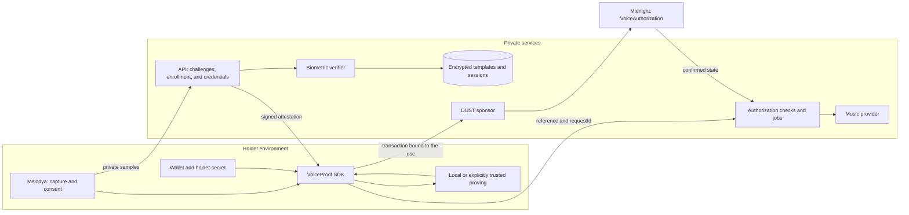

# Initial Architecture · Proof of Voice Authorization

**Status:** v0.1 proposal, without a protocol implementation or deployment.

**First consumer:** Melodya. **Initial interface:** a TypeScript SDK and reference services.

**Environments:** simulation/local → Preview → Preprod → Mainnet, with exit criteria at each stage.

## 1. Claim and trust boundaries

The system aims to prove that someone who knows the secret of a valid credential authorized a request and presented a valid voice verification attestation for that context.

Enrollment establishes continuity with a registered template. It does not certify civil identity, the legitimate origin of samples, or legal ownership of a voice.

| Actor | Responsibility and required trust |
| --- | --- |
| Holder | Control their secret and approve the consent they sign/prove |
| Application | Display the actual request and capture audio without replacing the approved context |
| Issuer | Issue/revoke credentials and correctly bind template and holder |
| Verifier | Evaluate audio under a versioned policy and sign only accepted decisions |
| Prover | Execute the circuit; it knows the witnesses it receives even when they are not published |
| Sponsor | Pay DUST and submit; it gains no authority over the holder |
| Contract | Enforce cryptographic constraints and update state |
| Music backend | Verify context/confirmation and enforce single consumption and permissions |

The circuit will verify a signature over a biometric decision. It will not run ML. A compromised issuer or verifier can issue false evidence within its authority; ZK does not repair that trust assumption. Key controls, rotation, pausing, and revocation are required.

## 2. Proposed components



The first reference client can be a Node.js CLI controlled by the holder. A web experience will follow without implicitly making the backend custodian of their secret. The SDK will not implement ML, a custom cryptographic engine, or a new wallet.

Remote proving introduces additional trust. Do not send secrets to an endpoint just because it uses HTTPS, or promise that witnesses remain local when they do not. The sponsor will receive a transaction bound to the action, not private inputs for reconstructing it.

## 3. Inspiration from midnight-prover-ios

Reviewed reference: [commit 05954e1](https://github.com/sleepydogo/midnight-prover-ios/tree/05954e163087c0c6c25734dbd77c926ddc69f55e).

| Observed pattern | VoiceProof decision |
| --- | --- |
| Core separated from file/network access through providers | Separate protocol from wallet, storage, and transport |
| Focused public proving and verification API | Authorization operations with explicit states and errors |
| Downloads checked against digests | Versioned artifacts with an authenticated manifest; reject mismatches |
| Documented memory, progress, and cancellation limits | Measure our circuits; cancellation before submission cannot cancel an already submitted transaction |
| Reference fixtures and an external consumer | Separate protocol tests, integration, and consumption of the published package |

We are not copying its Rust/Swift implementation or assuming binary compatibility. An iOS adapter will be evaluated later, subject to versions, circuit cost, and cross-verification. The MVP will reuse the official Midnight stack.

## 4. Protocol objects

These fields describe a logical model, not yet an interoperable serialization.

| Object | Bound content |
| --- | --- |
| `VoiceCredential` | Version, issuer/key ID, holder commitment, template commitment, policy/model, issuance, expiration, and status reference; issuer signature |
| `AuthorizationRequest` | Request ID, audience, purpose, immutable request commitment, execution deadline, and commercial-use/training permissions |
| `VoiceChallenge` | Random nonce, credential, network/contract, request/consent commitments, policy, phrase digest, issuance, and expiration; service authentication |
| `VoiceAttestation` | Challenge digest, credential/holder, request/consent commitments, policy/model, positive decision, validity window, and verifier key ID; verifier signature |
| `AuthorizationReceipt` | Version, network/contract, confirmed authorization reference, nullifier, and request/consent commitments; private link to the result |

Do not include audio, embeddings, scores, or phrase text on the ledger. The attestation does not need the score either: that evidence remains subject to private retention.

The template commitment will represent a random template identifier and its version/model with fresh randomness, not a bare hash of the embedding. The holder commitment separately binds the secret. The issuer signs the entire association, and the contract checks the required openings.

Before implementation, define canonical encoding, field sizes/ranges, consent representation, a signature scheme supported in Compact, and domain-separated commitment/PRF primitives. Do not concatenate strings or use `JSON.stringify` as a cryptographic definition. A signature checked only by the backend **does not satisfy** the circuit's objective.

## 5. Enrollment and issuance

1. Authenticate the account and generate a holder secret in their trusted environment.
2. Prove control of the secret, binding the holder commitment to the enrollment session.
3. Capture three random phrases with quality and anti-spoofing checks.
4. Extract/aggregate embeddings with a versioned model and policy; encrypt the template.
5. Create the template commitment and issue the signed credential with the holder commitment.
6. Register its initial status through an authorized issuer operation.
7. Delete samples according to the declared retention period; do not retain them for training by default.

ECAPA-TDNN and TitaNet are candidates. Normalization and thresholds will be calibrated for the selected model, languages, devices, and conditions. Version changes so that a new policy cannot silently reinterpret old evidence.

A compromised account must not be able to silently replace the holder. For v0.1, the proposed approach is revocation and reissuance through a new controlled process; define recovery before the pilot.

## 6. Authorizing a use

1. The backend fixes an immutable request with generation parameters, purpose, audience, and permissions. The app displays that same request.
2. The service issues a cryptographically random nonce and a short-lived challenge bound to credential, request, and consent.
3. The person consents and records the phrase. The verifier checks phrase, speaker, anti-spoofing, context, and expiration.
4. Only upon acceptance does it sign an attestation for that challenge. It does not accept a client-supplied positive result.
5. The holder constructs the proof with their secret, credential, attestation, and openings; the SDK verifies artifacts and prepares the transaction.
6. The sponsor adds funding using the official flow, without replacing the request, consent, or holder.
7. The contract checks and records the authorization/nullifier. The SDK distinguishes prepared, submitted, confirmed, and rejected states.
8. The backend independently checks the confirmed authorization, its context, and the execution deadline, then reserves one generation job for that request.
9. The result and its hash are linked to the receipt in private storage. Publishing an additional commitment will be an explicit later decision.

The request precedes the song: do not use `songHash` as an input known before generation. The receipt establishes authorization, not whether an external provider actually complied with training or commercial-use restrictions.

## 7. VoiceAuthorization.compact contract

Proposed minimum logical state:

- Approved issuers/verifiers, active keys, and allowed policies.
- Active/revoked credentials, updated only by an authorized party.
- Used nullifiers and minimal records of the authorized request/consent.
- Protocol version and pause/rotation controls.

The circuit must check:

1. Signatures under approved keys, supported versions, and currently valid authority.
2. An intact, valid, active, non-revoked credential in the execution state.
3. Knowledge of the secret that opens the holder commitment. A public key supplied as a witness does not authenticate the holder.
4. Agreement between credential, attestation, challenge, and consent.
5. Exact binding to network, contract, audience, purpose, and request.
6. Validity windows against ledger-supported time mechanisms, not the client's `Date.now()`.
7. Derivation of the correct nullifier and its absence from state.
8. Consistent recording of consumption and accepted authorization.

Writes must respect Midnight's transaction phases. Partial consumption without authorization must not enable generation; authorization without consumption must not either. Test these properties under transaction failures rather than inferring them from local success.

### Replay and off-chain consumption

Conceptually: `N = PRF(holderSecret, domain || challengeDigest)`. The digest binds the complete context and a service-issued nonce. The contract recomputes N; it does not accept an arbitrary client-supplied nullifier. The PRF and its encoding remain requirements for the executable specification.

On-chain uniqueness prevents accepting the authorization again. **It does not prevent resubmitting a confirmed receipt to the backend.** The backend must atomically reserve a job with a unique `(network, contract, nullifier)` key and an immutable request. Different request: reject. Same request: return the same job.

The music provider call will use a stable idempotency key. If the provider does not support one, exactly-once execution cannot be guaranteed after a timeout: reconcile before retrying, rather than blindly generating again.

### Revocation

Check revocation when authorizing on-chain and when admitting a job using sufficiently fresh state. The backend's reservation time will be the decision point for starting work. Define maximum staleness and behavior under concurrent revocation; do not start when state is uncertain.

Revocation blocks new uses. It does not delete previous receipts/songs or guarantee stopping a provider that has already started. Model changes, key rotation, and recovery require invalidation and reissuance rules.

## 8. Data and exposure

| Location | Permitted data and boundary |
| --- | --- |
| Holder environment | Secret and openings; never sent to the sponsor |
| Private verifier | Transient audio, template during computation, and internal scores |
| Private PostgreSQL | Encrypted templates, sessions, policies, credentials, and idempotent jobs |
| Private object storage | Audio with expiration/deletion and access-controlled songs |
| Ledger | Authority keys, commitments, revocation, nullifiers, and minimal references |
| Telemetry | Results and metrics without biometrics, secrets, or private payloads |

A public `credentialCommitment → status` registry simplifies v0.1 revocation, but public access to the identifier can correlate authorizations. This is an **initial pseudonymous design**, not an anonymous membership proof. Timing, issuer, and transaction structure can also enable correlation.

Do not publish names, email addresses, DIDs, or template IDs. DID is not a requirement. Request commitments will use randomness: hashing predictable values does not hide them by itself. Hiding detailed consent does not hide the existence of an authorization.

## 9. Planned interfaces and organization

Reference private API, not yet implemented:

| Operation | Responsibility |
| --- | --- |
| `POST /voice/enroll` | Complete controlled enrollment and issue a credential |
| `POST /voice/challenges` | Issue a challenge bound to an authenticated request |
| `POST /voice/verify` | Validate sample/context and return an attestation or rejection; no public score |
| `POST /voice/credentials/:id/revoke` | Authenticated and authorized revocation |
| `POST /generations` | Check confirmed reference/context and reserve a job |

`enroll`, `authorize`, `verifyReceipt`, and `revoke` are candidate SDK operations. The final API will be shaped with a real consumer. Local proof verification is not equivalent to confirming its transaction or consuming an authorization.

```text
packages/
  sdk/                     # TypeScript: public API and Midnight coordination
  protocol/                # Shared types, encoding, and test vectors
contracts/
  voice-authorization/     # Compact and circuit tests
services/
  api/                     # Challenges, issuer, sponsorship, and generation control
  voice-verifier/          # Python: models and biometric evaluation
examples/
  melodya/                 # Consumer using the SDK's public API
bench/                     # Measurements separate from examples
docs/
  architecture.md
```

This is a target structure, not implemented directories. API, issuer, and sponsor can initially coexist with separate permissions and keys. Add `apps/web` when building the user experience; the library will not depend on React.

## 10. Validation and acceptance criteria

| Case | Required result |
| --- | --- |
| Correct holder and evidence | Confirmed authorization and one job |
| Copied credential without the secret | Proof rejection |
| Altered signature, unknown key, or disabled verifier | Circuit rejection |
| Expired challenge or disallowed policy/model | Rejection |
| Changed audience, purpose, permissions, or request | Rejection |
| Reused challenge with an invented nullifier | Rejection |
| Replay or concurrent requests | One on-chain acceptance and one backend job |
| Revoked credential | No new authorizations/jobs under the policy |
| Fake receipt, pending/rejected transaction, or uncertain state | Generation blocked |
| Spoofing, playback, or cloning | Measure success by attack class; do not promise absolute protection |
| Compromised verifier | Acknowledge the boundary and test disabling, rotation, and recovery |
| Corrupt or unapproved artifact | Reject without falling back to an insecure mode |

Planned tests include cryptographic vectors, Compact simulation, proving/Preview integration, negative cases, package consumption outside the monorepo, and separate biometric evaluation. Synthetic fixtures are not evidence of voice accuracy.

Measure FAR/FRR and attack success with sample sizes and uncertainty; biometric/proving p50/p95 latency, confirmation, memory, abandonment, and cost per authorization. A 20–50-person pilot supports learning, not certification of a very low FAR.

## 11. Decisions required before closing v0.1

1. Compact-compatible signatures/encoding, test vectors, and actual circuit cost.
2. Holder custody/recovery and proving location for each client.
3. Model, anti-spoofing, thresholds, and measured acceptance criteria.
4. Time semantics, concurrent revocation, and rotation with adversarial tests.
5. Public receipt format, accepted correlation, and permission handling.
6. Retention/deletion, isolation, and authority key protection.
7. Music provider idempotency and reconciliation.

The first experiment is limited to credential + signed attestation + secret + challenge + consent + nullifier. It must demonstrate both acceptance and rejection on Preview. DID, portable VCs, and mobile proving will be evaluated afterward.

## References

- [midnight-prover-ios](https://github.com/sleepydogo/midnight-prover-ios): SDK boundaries, providers, artifacts, and external validation.
- [Midnight-Skills](https://github.com/Kali-Decoder/Midnight-Skills): Compact, SDK, testing, security, and networks; cross-check examples against installed versions.
- [Compact](https://docs.midnight.network/compact): circuit language and constraints.
- [Compatibility matrix](https://docs.midnight.network/relnotes/support-matrix): pin a compatible set when implementing.
- [DUST sponsorship](https://docs.midnight.network/guides/dust-sponsorship): separate holder authorization from funding.

These references inform the design; they do not certify VoiceProof or imply affiliation with their authors.
